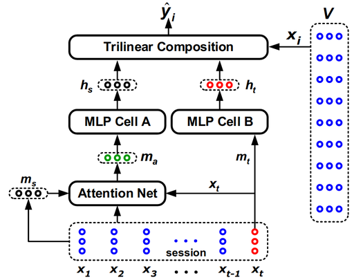
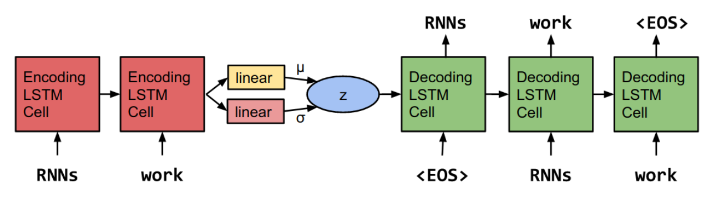

Sequence
----------
**Deep learning models for sequence related data, i.e. (language, sessions)**


## Installation

Only install dependencies by running or `$ pip -r requirements.txt` or install as (editable) library by `pip install -e .`


## STAMP: Short-Term Attention/Memory Priority Model forSession-based Recommendation
[See paper](https://www.kdd.org/kdd2018/accepted-papers/view/stamp-short-term-attentionmemory-priority-model-for-session-based-recommend)


Run **STAMP** on [Yoochoose 1/64](https://2015.recsyschallenge.com/): 

```
$ python run.py stamp \
--dataset='Yoochoose 1/64' \
--embedding_dim=100 \
-e=10 \
--lr=0.001  \
--batch_size=32 \
--model=stamp \
--scale_loss_by_lengths=false \
--train_percentage=0.95
 ```
 
 ### Results on test set
 
| Dataset  | Yoochoose 1/64 |        |
|----------|----------------|--------|
| Measures | P@20           | MRR@20 |
| STMP     | 64.44          | 30.45  |
| STAMP    | 65.36          | 30.84  |


## Generating Sentences from a Continuous Space
[See paper](https://arxiv.org/pdf/1511.06349.pdf)


## Options

```text
run.py [-h] [--logging_name LOGGING_NAME] [--batch_size BATCH_SIZE]
              [--save_every_n SAVE_EVERY_N] [--embedding_dim EMBEDDING_DIM]
              [--storage_dir STORAGE_DIR] [--tensorboard TENSORBOARD]
              [--lr LR] [-e EPOCHS] [--min_length MIN_LENGTH]
              [--max_length MAX_LENGTH] [--train_percentage TRAIN_PERCENTAGE]
              [--dataset DATASET] [--force_cpu FORCE_CPU]
              [--weight_decay WEIGHT_DECAY] [--global_step GLOBAL_STEP]
              [--continue MODEL_REGISTRY_PATH] [--optimizer OPTIMIZER]
              {vae,stamp} ...

positional arguments:
  {vae,stamp}
    vae                 Run VAE model
    stamp               Run ST(A)MP model

optional arguments:
  -h, --help            show this help message and exit
  --logging_name LOGGING_NAME
  --batch_size BATCH_SIZE
  --save_every_n SAVE_EVERY_N
                        Save every n batches
  --embedding_dim EMBEDDING_DIM
  --storage_dir STORAGE_DIR
  --tensorboard TENSORBOARD
  --lr LR
  -e EPOCHS, --epochs EPOCHS
  --min_length MIN_LENGTH
                        Minimum sequence length
  --max_length MAX_LENGTH
                        Maximum sequence length
  --train_percentage TRAIN_PERCENTAGE
  --dataset DATASET     Pickled dataset file path, or named dataset (brown,
                        treebank, Yoochoose 1/64). If none given, NLTK BROWN
                        dataset will be used
  --force_cpu FORCE_CPU
  --weight_decay WEIGHT_DECAY
  --global_step GLOBAL_STEP
                        Overwrite global step.
  --continue MODEL_REGISTRY_PATH
                        Path to existing ModelRegistry
  --optimizer OPTIMIZER
                        adam|sgd

```